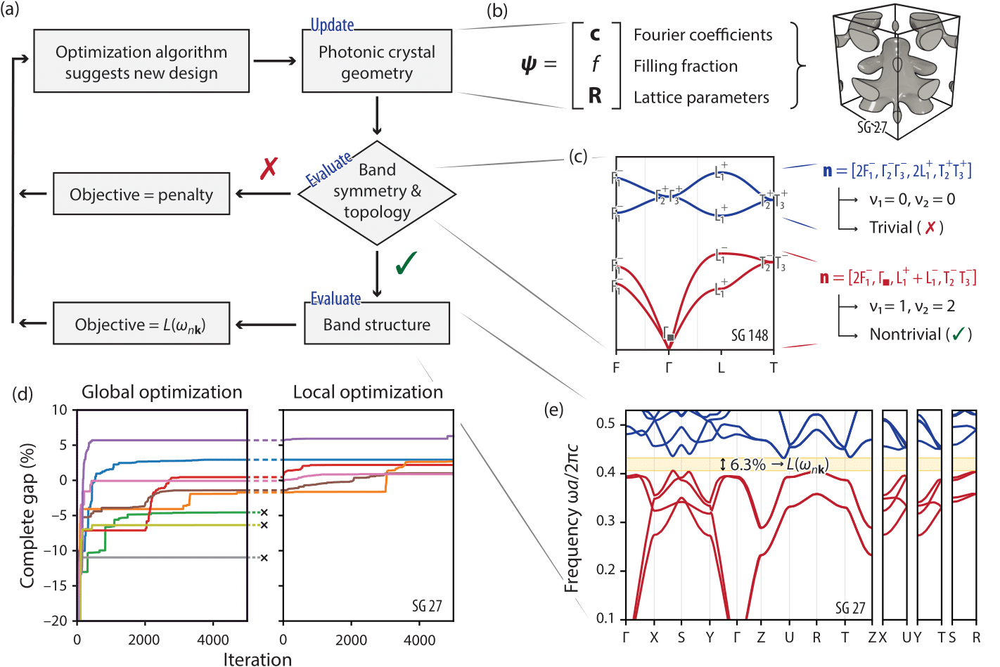

# Automated Discovery and Optimization of 3D Topological Photonic Crystals

This library is the official repository for the paper [Automated Discovery and Optimization of 3D Topological Photonic Crystals](https://arxiv.org/abs/2211.16560). 

## Citing

If you use any of this code, please cite:

```
@article{kim2022automated,
  title={Automated Discovery and Optimization of 3D Topological Photonic Crystals},
  author={Kim, Samuel and Christensen, Thomas and Johnson, Steven G and Solja{\v{c}}i{\'c}, Marin},
  journal={arXiv preprint arXiv:2211.16560},
  year={2022},
  doi={10.48550/arXiv.2211.16560}
}
```

## Introduction

We present a framework for automated discovery and optimization of 3D topological photonic crystals, using a combination
of off-the-shelf optimization tools, a level-set parameterization for the photonic crystal, and recently developed
tools based on band symmetries to evaluated band topology. 
The level-set parameterization consisting of a symmetry-constrained Fourier sum allows for parameterization of highly
complex photonic crystal geometries using a low-dimensional parameter space, enabling gradient-free optimization.
For optimization, we use various gradient-free algorithms implemented by [NLopt](https://github.com/JuliaOpt/NLopt.jl),
allowing us the flexibility to optimize arbitrary objective functions that may be non-differentiable.
In particular, we use global optimization algorithms (DIRECT-L-RAND) in conjunction with a stochastic local optimization
stage (sbplx and ISRES) to escape local optima and handle the non-continuous objective.
Finally, we use symmetry-based evaluation of band topology to quickly screen through candidates and discover novel
topological structures.

An overview of the optimization framework is shown below. 



## Optimization Overview

The main optimization files are all named `nlopt_[gap,gaps,chern][_local]*.jl` (e.g. `nlopt_gap.jl`), 
where the `_local` suffix denotes the local optimization variant.
- The `gap` variant maximizes Γ-enforced bands by maximizing the bandgap above a particular band.
For Γ-enforced bands, the minimal connectivity bands (i.e. the band index above which to maximize the gap) is found in
`topology.jl`. This can be easily extended to maximize any trivial/topological gap above a specific band.
- `gaps` allows the band to be above any number of bands, as long as those bands are non-trivial.
This code does not look for a specific type of topology, and is used in our work to look for Weyl points.
- `chern` looks for a specific type of topology and uses gyromagnetic materials.
This is used for looking for Chern insulators with time-reversal symmetry breaking.

The optimization scripts have a number of parameters at the top, including material index, simulation resolution,
and the name of the directory to save results to.
The scripts also take positional arguments `id` (which corresponds to the trial) and `sgnum`.
`nlopt_chern.jl` also takes the Chern number as an argument.

The optimization scripts save files named according to their iteration number, e.g., `1234.sh`.
It also copies over the files corresponding to the best candidates in a separate directory, `sub_dir+"-best"`.

### Note on cluster computing and file management

We calculate photonic crystal band structures using [MPB](https://mpb.readthedocs.io/en/latest/), a free and open-source
software package for computing electromagnetic modes of periodic structures.
Although there exists a Python interface for MPB, the Python interface does not currently support MPI parallelization,
and so we use the Scheme interface.
The Scheme interface requires writing a `.ctl` file as an input file to set up the simulation.
The Scheme version of MPB will also write an output file containing the results, from which we write additional files
using bash scripts to extract the relevant information.

Thus, in an iterative setting such as optimization, this process can result in writing thousands of new files
for each optimization run.
Unfortunately, this can be problematic for cluster computing setups that use a file management system
to sync up files across nodes, as the process of writing files can not only slow down the script, but also the
entire cluster.

To alleviate this issue, our scripts allow for the use of a temporary directory to write files, and it will periodically
copy those files to the permanent directory.
This is to take advantage of cluster setups that have a local directory that is not synced up with the file mangement
system and is thus significantly faster to read/write.
To use this, define an environment variable `$TMPDIR` that points to this local directory
(many cluster computing setups already have this defined).
The optimization script will automatically detect if this variable is defined and use the local directory.

Alternatively, if you wish to keep all the files in a run (e.g., for detailed post-processing),
be sure to comment out the code at the top of the script that re-defines the directories `in_dir`, `out_dir`, and
`log_dir`. The script will save the best results to a new directory with the suffix `-best`.

### Bash scripts

Due to the nature of the MPB Scheme interface (see above section), the Julia code calls various Bash scripts that in turn start MPB. 
These scripts are found in the `src/` directory with the `.sh` extension. 
Some of the lines in these scripts were written for our specific server (i.e. Supercloud) so yo u may need to adjust these for your own use.
Also note you may need to change the permissions to make the files executable, i.e. through `chmod`.

### Variable structure

The PhC is parameterized by `x` (and initialized by `x0`) which is a continuous vector, with length depending on the
space group `sgnum`. 
The first element of `x` corresponds to the filling fraction `ff`, which can vary `[0, 1)`.
The next set of elements are the basis parameters, each of which can vary `[0, 1)`. The basis parameters include
both the lattice vectors lengths and the angles between lattice vectors, if applicable. These are unnormalized
to the appropriate values by `params2flat`.
The remaining elemnts of `x` correspond to the free Fourier lattice coefficients. In the absence of inversion symmetry,
these coefficients are split into their real and imaginary components so that NLopt only needs to optimize over real
parameters.

To summarize, `x` should be structured as `[isoval, basisparams, flatparams]`

These are converted into more interpretable lattice parameters using the following function:
```julia
ff, pRs, flat = params2flat(x, sgnum; cntr=cntr, hasinv=hasinv, abclow=0.75, abchigh=1.25)
```

### Optimization stages

The full optimization framework consists of two stages: global and local optimization.
The global optimization stage should almost always be used first (rather than starting local optimization from a random
point) due to the highly non-convex and constrained nature of the problem.
Otherwise the starting point is unlikely to be topological (and local optimization will not be able to find a
topological example), or if it happens to be topological, the local optimization will get stuck in a local optima.

The global optimization stage will output a directory for each trial, e.g. `global-1/`, `global-2/`, etc.
Each directory contains a file `summary.txt` which contains information on the top candidates and their bandgap
The top candidate can serve as a starting point for the local optimization stage.
As an aside, to more conveniently view information across all trials, you can perform the command
```
cat global-*/summary.txt > global-summary.txt
```
in the terminal to combine all the files into one.

Once you have candidates for local optimization, you can define variables `trial_ids` and `global_best_ids` in the
local optimization script (e.g. `nlopt_gap_local.jl`), which are both lists of integers for the trial and iteration,
respectively, for the best candidates.
For example, if we want to start a local optimization run from iteration 944 in trial 2, we would define:
```julia
trial_ids = [2]
global_best_ids = [944]
```
The list structure allows you to define multiple starting points, each of which is optimized separately in a separate trial.

## Simple Analysis

As mentioned above, by default, the optimization scripts will automatically keep track of the best candidates during the run and automatically save those files in a separate directory, e.g. `global-#-best/`.
If for whatever reason you have the files from the original run (e.g. in `global-#/`) and want to do processing to find the best candidates, you can write a simple script such as `process/process_nlopt_gap.jl`.

To plot and save the band structures for all of the dispersion files in a directory, you can use something like `process/plotdirdisp.jl`.
The other variants such as `process/plotdirdispgaps.jl` and `process/plotdirdispchern.jl` essentially do the same thing,
except that they print different information to the plot title (e.g. the topological indicator)
To do the same for photonic crystal structures, use `process/plotdirpc.jl`.

## Full BZ Analysis
Analysis for simulations run across the entire BZ over a dense k-point grid are in the directory `fullbz/`.
This includes scripts for generating MPB files for running full BZ simulations, calculating and plotting the
locations of nodal lines/Weyl points, and calculating density of states (DOS).

### Generate files for full BZ simulations
The scripts in `fullbz/gen_bz_full/` generate MPB files for running full BZ simulations, including a `.sh` file
which has all the parameters, and a `.dat` file which contains the list of k-points to simulate. There is a separate
`.jl` file for each space group of interest (i.e. `bzfull_sg13.jl`) since we only simulate a portion of the full BZ
based on the symmetries of that space group. We can use symmetry operators in post-processing to restore the full BZ.

### Post-processing: band degeneracies
The degeneracies are generally mapped out by taking the difference between the bands below and above the HS gap,
and calculating the isosurface contour at a value close to the minimum of the difference (which is ideally close to 0).

I would recommend running one of `plot_mesh_sg#.jl` first, which plots the degeneracy isosurface with no assumptions
on the location or dimensionality of the degeneracies. 
This makes it easy to see if the degeneracies are as expected and what kind of post-processing is needed.
For example, in SG 81, we can have either 4 or 8 Weyl points in the BZ. 
In SG 82, the Weyl points are not aligned with any slice in the reciprocal lattice basis, so it helps to know ahead of
time approximately where the Weyl point is.

#### Plotting nodal line

In SG 13, the nodal lines should run along the k_y axis.

`nodalfreq_frommesh.jl` and `nodalfreq_fromslice.jl` plot the frequency of the nodal line as a function of k_y. 
The former script uses the isosurface contour mesh, which is very noisy. 
The latter calculates the nodal line position in each k_y slice, and interpolates to calculate the nodal line frequency.
This approach is much cleaner.
Note that in some cases, the nodal line crosses the BZ boundary, which can cause artifacts (large spikes) in the plot
due to miscalculating the centroid, and thus the nodal line position.
This can be remove in post-processing, or avoided by copying the data over the BZ boundary.

`plotnodal_sg13.jl` plots the nodal line along with the BZ, where the nodal line is colored according to the frequency
at each point.
Note that nodal line is not always neatly inside the 1st BZ, so we have to manually move parts of it to make a nice
visualization.

`plotnodalslice_sg13.jl` is useful for debugging, as it plots the specified k_y slice of the band difference, 
as well as the contour and centroid.

#### Plotting Weyl points
The scripts for plotting Weyl points as well as the Fermi pockets are in `plotpockets_sg#.jl`. 

The scripts for SG 27 and SG 37 assume that the Weyl points lie on the k_3=0.5 (k_z=pi in Cartesian basis) plane.
The general workflow is that they take the k_3=0.5 slice of the data, calculate the minimal band difference contour line
in that slice, and calculate the centroid of the contour polygon to get the Weyl point location.
To get the Weyl point frequency, we interpolate (in 3D) the bands below and above the gap at the Weyl point location to get two estimates, and then average these two estimates. 
(One can also interpolate the slices in 2D, although empirically 3D interpolation seems to be more accurate. 
Regardless the difference is usually negligible.)
Finally, isocontour surfaces are calculated at the Weyl point frequency to detect Fermi pockets.
The Weyl points and Fermi pockets are plotted in the Cartesian basis, along with the HS path.

There are two scripts for SG 81: `plotpockets_sg81.jl` and `plotpocketssg81_double.jl`.
This is because there are multiple possibilities for the topological index that result in different number of Weyl 
points.
The first file assumes Weyl points at k_3=0.5, while the latter assumes Weyl points at both k_3=0 and k_3=0.5.

The scripts for SG 82 makes no assumption on where the Weyl points lie (they lie in k_z=0, but this does not correspond
to a clean cross-section in the reciprocal lattice basis) and so the location of the Weyl points are found by
calculating the centroid of the minimal difference contour *surface* (a 3D polyhedron). 
Note that this can result in the location of the Weyl points being slightly offset from k_z=0 if the data is 
low-resolution, but one can trivially project it to the k_z=0 plane in the Cartesian basis.

The scripts `weylslice_sg#.jl` are useful for debugging, as they plot the appropriate k_3 slice of the bands and 
the band difference, as well as the contour and centroid.

### Post-processing: DOS
All the files related to calculating DOS are in `fullbz/DOS-calculation/`.
The core calculation files are taken from https://github.com/boyuanliuoptics/DOS-calculation. 
I have only included the MATLAB files, the original repo also has a Python port.

To convert the dispersion file into a form that the DOS-calculation can use, use `convert_file.jl`.
The files `DOS_Tr_SG#.m` calculate the actual DOS. The only difference between these variants is the variable
`num_kpoints`, which defines the number of k-points in each direction.
Though in principle, this probably can be automated as well.

Finally, `plotdata.m` is a simple script to quickly plot the DOS.

## FAQ

### Installing MPB

Note that MPB must be built from [source](https://github.com/NanoComp/mpb) for this project. While MPB in general is available through commonly available tools (e.g. `apt-get`, `conda`), these do not contain the latest version of MPB, which incorporates the tools for analyzing symmetry eigenvalues.

### Other systems

If you are interested in applying this method to other systems (e.g. metallic, phononic, synthetic crystals), you can
use most of the code in `opt_utils.jl` for optimization wrapper code and `params.jl` for the level-set parameterization.
Note that `recordbest(...)` in `opt_utils.jl` is specific to MPB input/output file formats, but this can be changed
easily.
